# Deploying a Library Application on Killer Koda Kubernetes

### Step 1: Start the Killer Koda Kubernetes Environment
1. Launch the Killer Koda Kubernetes playground.
2. Verify the cluster setup:

```bash
  kubectl get nodes
```
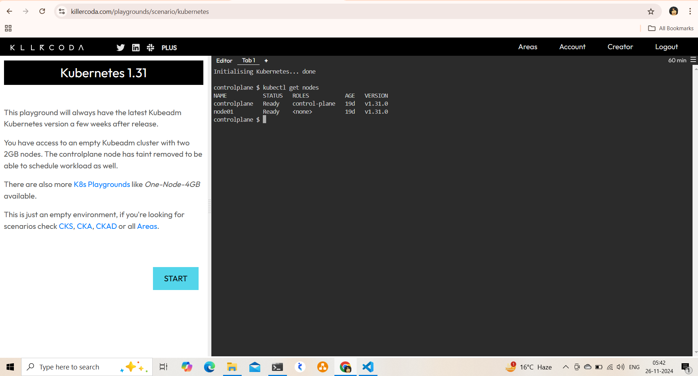

### Step 2: Create Kubernetes Secrets
1. Use the editor in Killer Koda to create the secrets.yaml file or directly write it using nano or vim:

```bash
   vi secrets.yaml
```

2. Add the secrets configuration (as shared earlier) and apply:

 ```bash
   Kubectl apply -f secrets.yaml
```
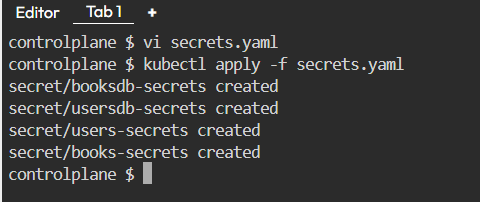
### Step 3: Deploy the Databases

1. Create usersdb.yaml and booksdb.yaml directly in Killer Koda using the in.browser file editor or terminal.
2. Save the YAML files and deploy them:


```bash
   kubectl apply -f usersdb.yaml
   kubectl apply -f booksdb.yaml
```
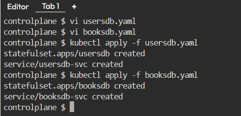

 once try to check whther the database pods are in running state or not 
 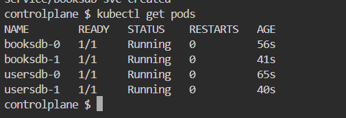

### Step 4: Deploy the Microservices

1. Use the YAML configuration for users-svc and books-svc as explained previously.
2. Apply the files

```bash
   kubectl apply -f users-svc.yaml
   kubectl apply -f books-svc.yaml
```
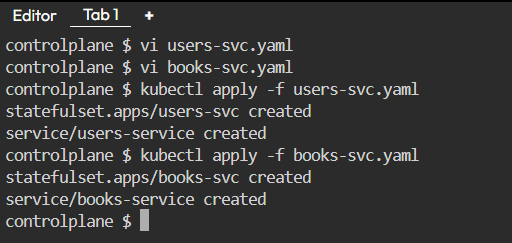

now you must be seeing svc pods including databases pods
i maintained the replica count as 4 for all

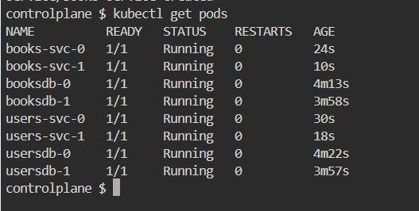

once verify all the created resources as of now 
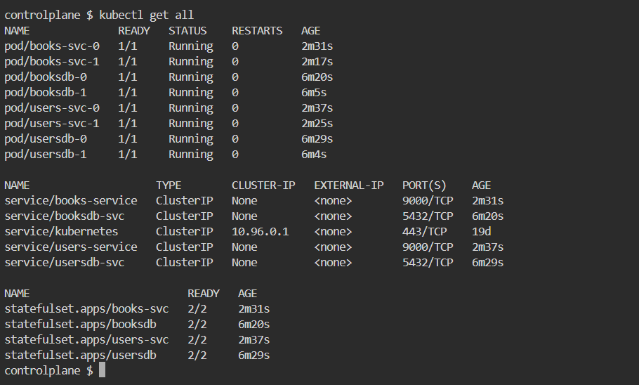

### Step 5: Deploy the Frontend Application

1. Write the YAML for the web application (library-web.yaml) and deploy it.

```bash
   kubectl apply -f library-web.yaml

```
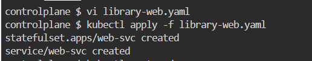
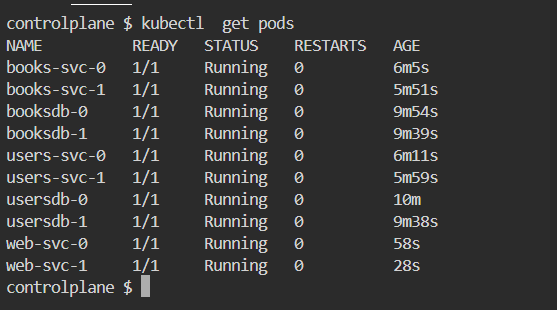

### Step 6: Verify and Test
1. Verify all resources:
 
```bash
   kubectl get all
```
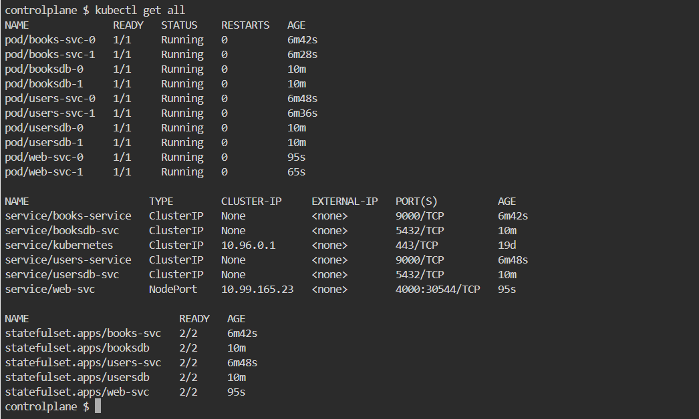

2. Access the application using the NodePort. Use the external IP or any port forwarding if required within the Killer Koda environment

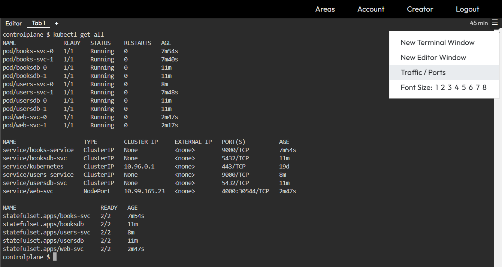
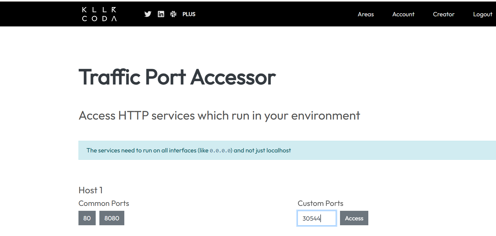

3. You can see the application on web


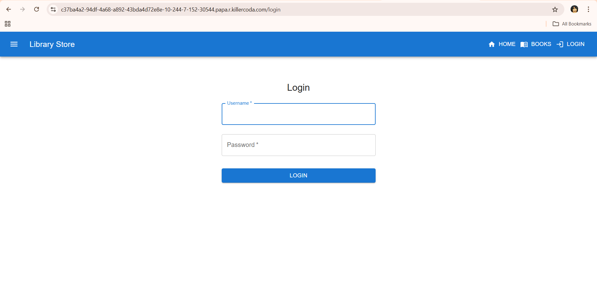

## Summary
This project showcases a full-stack library application deployed on Kubernetes, utilizing StatefulSets for reliable database management, secure secrets handling, and seamless service communication. By following this approach, you achieve:

* Scalable and fault-tolerant deployments.
* Secure and stable data persistence.
* Modular and reusable YAML configurations.