# Library Application Deployment

This document outlines the steps and configurations for deploying a library application in a Kubernetes cluster. This setup includes deployments and services for `users-db`, `books-db`, `users-deploy`, `books-deploy`, and `library-deploy`. The `library-deploy` is exposed as a NodePort service for external access.

**Note:** This deployment was set up and tested in the Killer Koda environment, with accessible Docker images hosted on Docker Hub.

---

## Prerequisites

To deploy this application, ensure you have the following in place:

- **Kubernetes Cluster**: A Kubernetes environment, set up in Killer Koda, or any compatible Kubernetes platform.
- **kubectl**: Configured to interact with your Kubernetes cluster.
- **Docker Images**: Custom application images hosted on Docker Hub:
  - `deepakvakkala123/libuserssvc:1.0`
  - `deepakvakkala123/libbookssvc:1.0`
  - `deepakvakkala123/libwebstore:1.0`
  
- **Environment Configurations**: Essential configurations managed using Kubernetes ConfigMaps for database credentials, API URLs, and secret keys.

---
## Step 1: Configuration
Each database and application has associated ConfigMaps for environment variables.

**Filename:** `config.yaml`

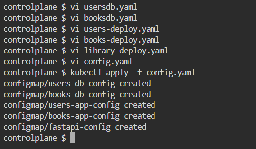

## Step 2: Database Deployment

* ### Users Database (usersdb.yaml)

The `usersdb` service uses PostgreSQL to store user data. It is deployed as a ReplicaSet and exposed as a ClusterIP service.

  **Filename:** `usersdb.yaml`

* ### Books Database (books-db)

Similarly, books-db is deployed as a ReplicaSet with a ClusterIP service.

**Filename:** `booksdb.yaml`

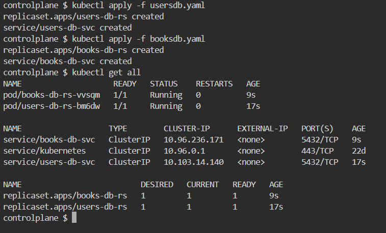

## Step 3: Application Deployment

Users Application (users-deploy)
This deployment handles user-related operations. It’s deployed as a Deployment with a ClusterIP service.

**Filename:** `users-deploy.yaml`

Books Application (books-deploy)
This deployment manages book-related functionalities. It also has a ClusterIP service.

**Filename:** `books-deploy.yaml`

Library Frontend (library-deploy)
The frontend application is deployed with NodePort to allow access from outside the cluster.

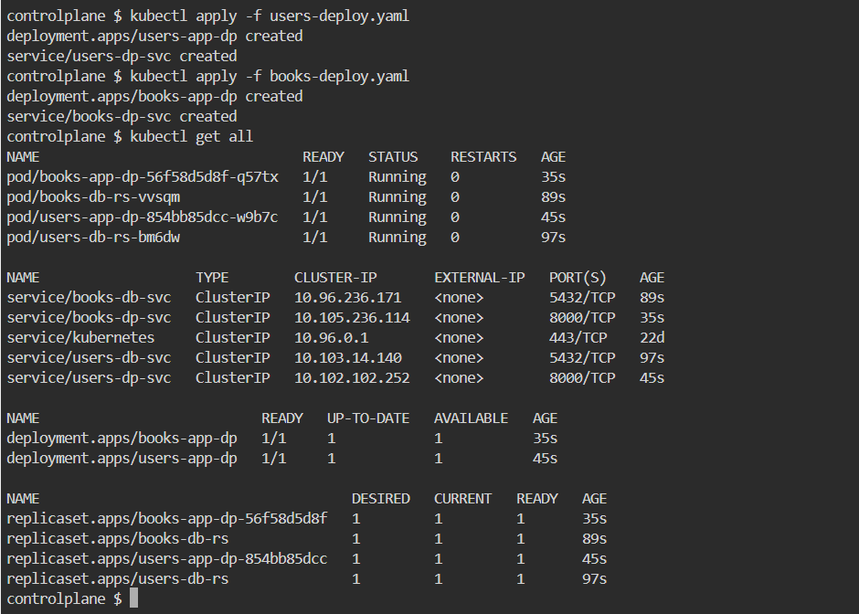

**Filename:** `library-deploy.yaml`

  - check all the individual services once  
   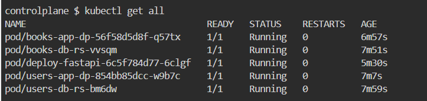
   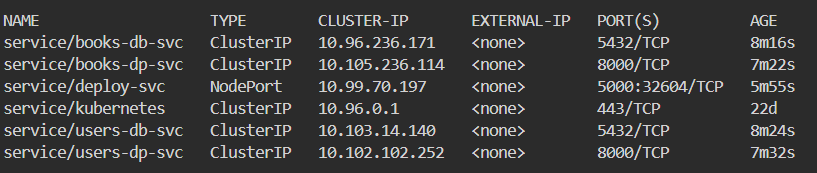
   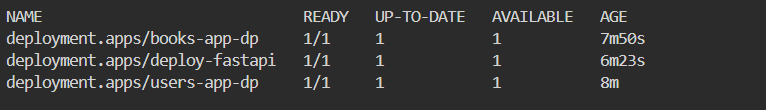
   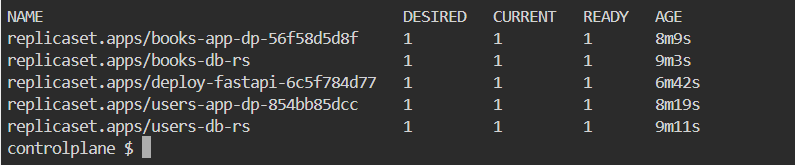

## Step 4: Accessing the Application
Since library-deploy is exposed as a NodePort service, you can access it via the cluster's node IP and the specified port (5000 in this case).

### To access the deployed application:

* In the Kubernetes environment dashboard, go to the dropdown menu in the top-right corner and select Traffic and Ports.

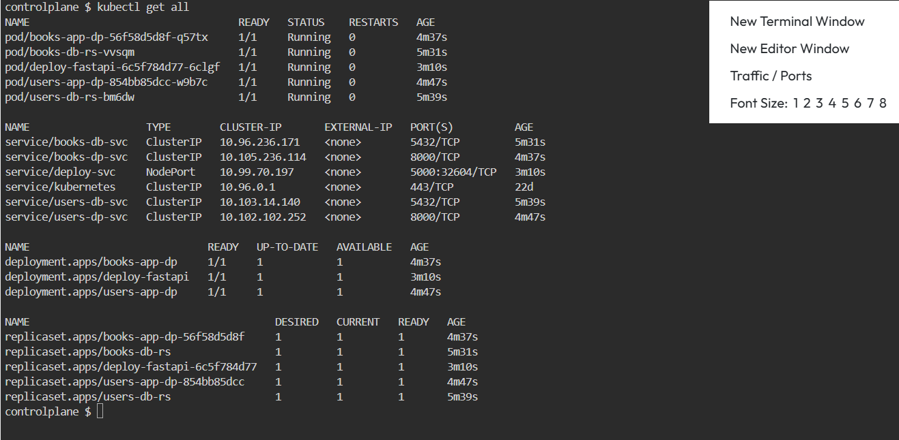

* Locate and enter the port of the library-deploy.

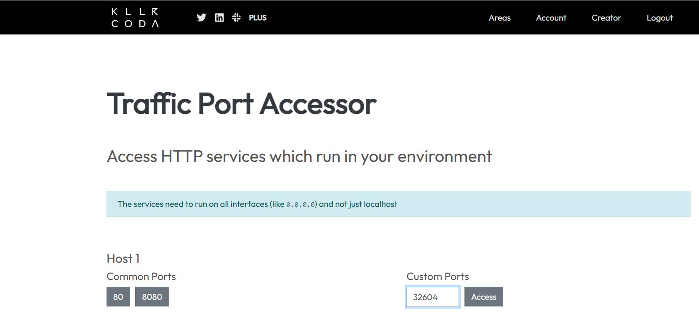

* we get Use the URL format of application by clicking on access

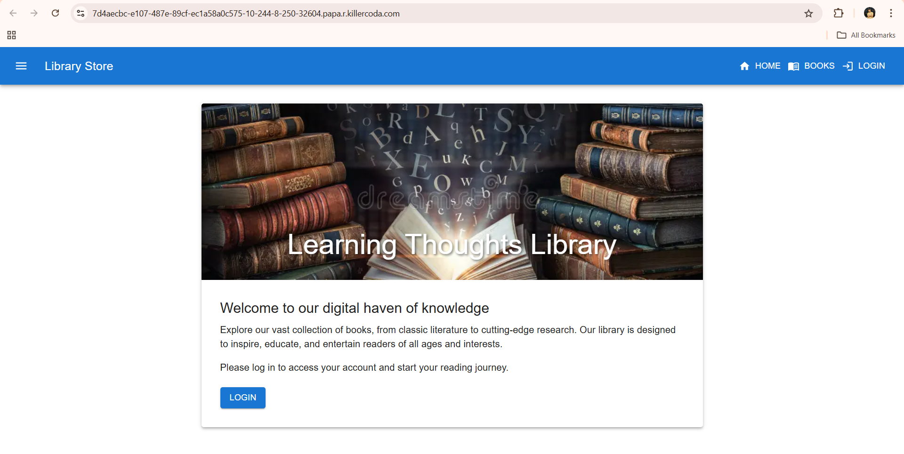

when you click the login 

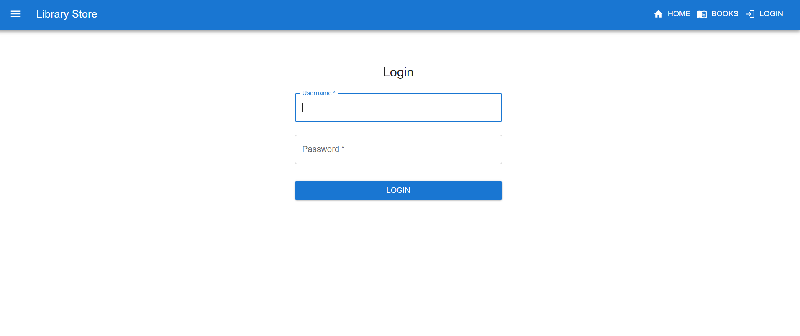

# Conclusion

The application was successfully deployed and accessible from external networks. For a visual walkthrough of each deployment's output, please refer to the attached screenshots taken during setup in the Killer Koda environment.

